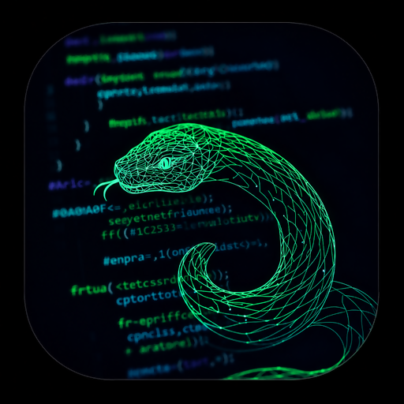

# Python Learning IDE

<div align="center">
  
  <h3>Учись Python на Android</h3>
  <p>Полноценная IDE с интерактивными уроками для изучения Python прямо на вашем телефоне</p>

  
  
  
  

  **Автор**: [EMERLUKOV](https://github.com/emerlukov)
</div>

---

## 📱 О проекте

**Python Learning IDE** — это не просто редактор кода, а полноценная обучающая среда для Python на Android. Приложение сочетает в себе мощный редактор с подсветкой синтаксиса и структурированный курс для начинающих.

Вы можете писать, редактировать, запускать код и одновременно проходить уроки, закрепляя теорию на практике, прямо со своего мобильного устройства.

### ✨ Ключевые возможности

| Функция | Описание |
|---------|----------|
| 🧑‍🏫 **Встроенные уроки** | Многоуровневый курс Python с теорией, практикой и автоматической проверкой заданий. |
| 🖥️ **Редактор кода** | Подсветка синтаксиса (Pygments), нумерация строк, автодополнение и сворачивание блоков кода. |
| 📁 **Файловый менеджер** | Полноценная работа с файловой системой: открытие, сохранение, переименование, удаление файлов с сортировкой. |
| 📑 **Вкладки** | Работа с несколькими файлами одновременно; контекстное меню для управления вкладками. |
| 🎨 **Настраиваемый интерфейс** | Светлая и тёмная темы, выбор языка (RU/EN), более 20 стилей подсветки синтаксиса, смена шрифта редактора. |
| ⚡ **Выполнение кода** | Запуск кода прямо в приложении, с поддержкой пользовательского ввода (`input()`). |
| 🔍 **Поиск и замена** | Быстрый поиск, замена текста и переход к строке в редакторе. |
| 🛠 **Инструменты разработки** | Форматирование кода (autopep8), Undo/Redo, работа с буфером обмена, история выполнения. |

---

## 📸 Скриншоты

<!--


-->
---

## 🚀 Установка

### На Android (APK)

1. Скачайте последнюю версию APK из [Releases](https://github.com/emerlukov/python-learning-ide/releases)
2. Разрешите установку из неизвестных источников в настройках Android
3. Откройте скачанный APK-файл
4. Нажмите "Установить"

### Для разработки (ПК)

#### Требования
- Python 3.10 или выше
- pip (менеджер пакетов Python)

#### Установка

```bash
# Клонируйте репозиторий
git clone https://github.com/emerlukov/python-learning-ide.git
cd python-learning-ide

# Создайте виртуальное окружение
python -m venv venv

# Активируйте виртуальное окружение
# Windows:
venv\Scripts\activate
# Linux/Mac:
source venv/bin/activate

# Установите зависимости
pip install -r requirements.txt

# Запустите приложение
python main.py
```
## 📦 Зависимости

| Пакет | Версия | Назначение |
|-------|--------|-------------|
| kivy | 2.3.1 | Графический фреймворк |
| kivymd | 1.2.0 | Material Design виджеты |
| pygments | - | Подсветка синтаксиса |
| plyer | - | Вибрация и системные функции |
| autopep8 | - | Форматирование кода |
| buildozer | - | Сборка APK (опционально) |

```bash
pip install kivy==2.3.1 kivymd==1.2.0 pygments plyer autopep8 buildozer
```
```
📁 Структура проекта
PythonLearning/
├── core/                    # Ядро приложения
│   ├── settings.py          # Управление настройками
│   ├── themes.py            # Управление темами и стилями
│   ├── translations.py      # Переводы (RU/EN)
│   └── lessons.py           # Управление уроками и прогрессом
├── managers/                # Логика и менеджеры
│   ├── autocomplete.py      # Автодополнение кода
│   ├── executor.py          # Выполнение Python-кода
│   ├── input_handler.py     # Обработка ввода
│   ├── emergency_recovery.py # Восстановление после краша
│   ├── file_handlers.py     # Файловые операции
│   └── tab_manager.py       # Управление вкладками
├── ui/                      # Компоненты интерфейса
│   ├── course_menu.py       # Меню курсов и уроков
│   ├── lesson_view.py       # Отображение урока
│   ├── menus.py             # Меню (язык, тема, шрифт)
│   └── top_bar.py           # Верхняя панель
├── utils/                   # Утилиты и хелперы
│   ├── android_utils.py     # Android-специфичные функции
│   ├── debug_utils.py       # Отладка и логирование
│   ├── error_explainer.py   # Объяснение ошибок
│   ├── screen_utils.py      # Адаптация под разные экраны
│   └── vibration_manager.py # Централизованное управление вибрацией
├── widgets/                 # Кастомные виджеты
│   ├── bars.py              # Панели инструментов
│   ├── dialogs.py           # Диалоговые окна
│   ├── editor.py            # Редактор кода с нумерацией
│   ├── interactive_code.py  # Код с полями для ввода (уроки)
│   └── markdown_label.py    # Отображение теории в уроках
├── fonts/                   # Шрифты приложения
├── data/                    # Данные приложения
│   ├── examples.json        # 25 примеров кода
│   └── course.json          # Структура курсов и уроков
├── tests/                   # Автоматические тесты
├── animated_splash.py       # Анимированная заставка
├── file_manager.py          # Файловый менеджер
├── app.py                   # Главный класс приложения
├── main.py                  # Точка входа
├── buildozer.spec           # Конфигурация для сборки APK
└── README.md                # Документация
```

## 🎮 Управление и навигация

### Верхняя панель

| Кнопка | Действие |
|--------|----------|
| **"Примеры"** | Быстрая вставка готовых скриптов (25 примеров). |
| **"Py"** | Открывает меню **"Курс"** с доступом к интерактивным урокам. |
| **"☰"** | Главное меню с настройками и инструментами. |

---

## 📚 Система обучения (меню "Py")

Система обучения построена на основе файла `data/course.json` и предлагает структурированный подход к изучению Python.

- **Список курсов**: Отображает доступные курсы (например, "Основы", "ООП", "Исключения") и прогресс по каждому из них.

- **Список уроков**: При выборе курса показывает список уроков с их статусами:
  - 🔒 **Заблокирован** — урок недоступен, пока не пройден предыдущий.
  - ▶️ **Доступен** — урок можно начать изучать.
  - ✅ **Пройден** — урок завершен, получены очки опыта (XP).

- **Просмотр урока**: При открытии урока отображается модальное окно с четырьмя вкладками:
  1. **Теория** (`theory_ru/en`): Учебный материал, написанный в формате Markdown.
  2. **Задание** (`task_ru/en`): Описание задачи, которую нужно решить. В этой вкладке также отображаются **шаблоны** (`ready_codes_ru/en`) — готовые блоки кода, которые можно скопировать и использовать как основу для решения.
  3. **Практика** (`template_ru/en`): Интерактивный редактор с полями для ввода (обозначены как `§`). Пользователь заполняет пропуски и запускает код, чтобы проверить решение.
  4. **Подсказка** (`hint_ru/en`): Дополнительная помощь, если задание вызывает трудности.

- **Система прогресса**: За каждый пройденный урок начисляются очки опыта (XP), а также открывается доступ к следующему уроку (`unlocks`). Общий прогресс отображается на главном экране курса.

---

### Панель действий (Action Bar)

| Кнопка | Действие |
|--------|----------|
| ↩️ | Отменить (Undo) |
| ↪️ | Повторить (Redo) |
| 📋 | Копировать |
| 📌 | Вставить |
| ✂️ | Вырезать |
| ✓ | Выделить всё |
| 🔧 | Автодополнение |
| 🔑 | Ключевые слова Python |
| 🧹 | Очистить весь код |
| 🔍 | Поиск |
| 🔄 | Поиск и замена |
| ⬇️ | Перейти к строке |

### Панель символов (Symbol Bar)

- Табуляция
- Скобки: `( )`, `[ ]`, `{ }`, `" "`, `' '`
- Операторы: `=`, `:`, `+`, `-`, `*`, `/`, `%`
- Спецсимволы: `#`, `@`, `&`, `|`, `!`, `?`, `;`

### Главное меню (☰)

- **Загрузить** — загрузка кода из файла
- **Сохранить** — сохранение кода в файл
- **Поиск** — поиск текста в коде
- **Заменить** — поиск и замена
- **История** — просмотр истории выполнения
- **Формат** — форматирование кода
- **Настройки** — язык, тема, шрифт, подсветка


## 🏗️ Сборка APK (для разработчиков)

### Способ 1: Через buildozer (Linux/Mac)

```bash
pip install buildozer
buildozer init
# Отредактируйте buildozer.spec
buildozer -v android debug
```

### Способ 2: Через WSL2 (Windows)

```bash
# Установите WSL2
wsl --install

# В Ubuntu:
sudo apt update
sudo apt install -y python3-pip git zip unzip openjdk-17-jdk
sudo apt install -y autoconf libtool pkg-config zlib1g-dev
pip3 install buildozer cython

cd /mnt/c/Users/emerl/PycharmProjects/PythonProject3
buildozer -v android debug
```

### Результат

Готовый APK-файл будет находиться в папке `bin/`

## 🤝 Как помочь проекту

Мы приветствуем любую помощь! Вы можете:

1. **Сообщать об ошибках**: Создавайте Issue с подробным описанием проблемы и шагами для воспроизведения.

2. **Предлагать идеи**: Создавайте Issue с меткой `enhancement` для обсуждения новых функций.

3. **Вносить свой вклад в код**:
   - Форкните репозиторий.
   - Создайте ветку для новой фичи (`git checkout -b feature/amazing-feature`).
   - Зафиксируйте изменения (`git commit -m 'Add some amazing feature'`).
   - Отправьте изменения в свой форк (`git push origin feature/amazing-feature`).
   - Откройте Pull Request в основной репозиторий.

## 📄 Лицензия

Распространяется под лицензией MIT. Подробности см. в файле `LICENSE`.


## 📧 Контакты

**Автор**: [EMERLUKOV](https://github.com/emerlukov)

**Email**: [emerlukov@gmail.com](mailto:emerlukov@gmail.com)

**GitHub**: [github.com/emerlukov](https://github.com/emerlukov)

## 🙏 Благодарности

- **Kivy** — за отличный графический фреймворк
- **KivyMD** — за Material Design компоненты
- **Pygments** — за подсветку синтаксиса

---

<div align="center">
  <b>Сделано с ❤️ для изучения Python</b>
</div>
